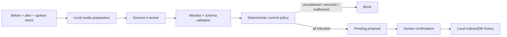

# ScenePatch

**Git for physical creative setups.** ScenePatch compares a before photo, an
after photo, and a short spoken instruction. Gemma 4 proposes a semantic diff;
deterministic TypeScript policy blocks unexplained or uncertain changes and
requires a person to confirm every clean commit.

[Open the public app](https://praharsh-projects.github.io/scenepatch-gemma4/) ·
[Read the architecture](docs/architecture.md) ·
[Inspect the reproducibility notebook](notebooks/scenepatch_gemma4.ipynb) ·
[Review the Kaggle writeup draft](docs/KAGGLE_WRITEUP.md) ·
[Read the security snapshot](docs/SECURITY.md)

ScenePatch is a solo entry for Kaggle's
[Build with Gemma](https://www.kaggle.com/competitions/build-with-gemma-gdgunn/overview)
hackathon. It targets small, controlled art-desk scenes. It is not an inventory,
theft, hazard, compliance, or forensic system.

> **Release status:** the pinned browser q4f16 runtime loaded and emitted native
> calls on the M4 Pro engineering machine, but it proposed a commit for the
> missing-blue-marker fixture. That fails the required semantic gate. The public
> GitHub Pages build is therefore a clearly labeled scripted fixture replay; the
> official-checkpoint Kaggle notebook is the primary executable Gemma path.

## What is implemented

- A polished, anonymous React/TypeScript PWA with setup, capture, semantic-diff,
  and local-history screens. Its Pages release mode labels all fixture outcomes
  as scripted replay rather than model evidence.
- Local multimodal inference with
  [`onnx-community/gemma-4-E2B-it-ONNX`](https://huggingface.co/onnx-community/gemma-4-E2B-it-ONNX),
  `q4f16`, Transformers.js, WebGPU, and a dedicated worker.
- One labeled 1024×512 before/after contact sheet and a 16 kHz mono voice clip
  capped at ten seconds.
- Exactly three Gemma function declarations: `record_change`, `commit_patch`,
  and `block_commit`.
- A strict executor that allowlists tools, validates bounded arguments, rejects
  duplicates, requires one terminal call, retries malformed output once, and
  overrides unsafe commit proposals.
- Human-confirmed IndexedDB history with schema-validated JSON export/import.
  Live audio is never persisted; selected images are retained only when the
  reviewer explicitly opts in.
- Three reproducible canvas fixtures: missing marker, corrected scene, and an
  occluded scene that should fail closed.
- A GitHub Pages static export, generated PWA asset precache, Apache-2.0 license,
  release documentation, and an independent Kaggle GPU notebook.

## Evidence status

Implementation and deterministic tests are complete. Real-model results are not
fabricated: the browser gate failed its core missing-object trial, so no browser
accuracy, dependable-commit, privacy-trace, or offline claim appears in the
competition draft.

| Claim | Current evidence |
|---|---|
| Strict tool policy and fail-closed storage | Automated unit tests |
| Production and GitHub Pages builds | Automated build and rendered-HTML tests |
| Anonymous public app/repository | HTTP 200 and fresh-browser flow verified 31 July 2026 |
| Anonymous public Kaggle notebook/dataset | Explicit V3 notebook and output URLs plus dataset returned HTTP 200 |
| Competition linkage/submission | Notebook linked; no submission made (`0/5`, “No Submissions”) |
| Browser image + voice Gemma mechanism | Loaded, inferred, and parsed on M4 Pro; semantic gate failed |
| Missing-marker block | **Failed:** browser model proposed a clean commit |
| Official-checkpoint controlled-fixture run | Competition-linked V3 (`339575640`) completed its batch: bad and occluded blocked by host policy; corrected remained pending human confirmation |
| Five clean and five blocked hero trials | Not met; the notebook evidence is one pass and the required five-consecutive M4 Pro gate was not run |
| Inference after disconnecting Wi-Fi | Not tested; no offline claim |
| Offline reload | Not claimed unless the stronger test passes |
| Fixture provenance and publication rights | At 2026-08-01 22:03:40 CEST, the entrant approved public use of the exact five hashed generated-v1 media files for the repository, Kaggle dataset/notebook, and demo video; see [`docs/FIXTURE_RIGHTS.md`](docs/FIXTURE_RIGHTS.md) |

The interface reserves approximately 3.65 GB for the selected model cache. The
actual transfer size and first-load duration must be measured against the pinned
release revision rather than copied from this estimate.

## Run locally

Prerequisites: Node.js 22.13 or newer and a current desktop Chrome/Edge build
with WebGPU and `shader-f16` support.

```bash
npm ci
npm run dev
```

Open `http://localhost:3000`. Development mode exposes the experimental browser
runtime for inspection; it is not release-qualified. `npm run build:pages`
intentionally compiles the public scripted-replay mode instead.

Useful release commands:

```bash
npm run typecheck
npm run lint
npm test
npm run build:pages
node scripts/verify-fixture-pack.mjs fixtures/generated-v1
```

The Pages artifact is emitted to `dist/client`. Its service worker precaches the
replay UI, CSS, manifest, and icons. It deliberately excludes the experimental
Gemma worker and 22 MB ONNX Runtime binary from automatic replay downloads.
Model files are not redistributed by this repository.

## Decision boundary

Gemma emits proposals in its native tool-call format. The application never
evaluates model text as code and never grants the model network, DOM, file,
shell, or IndexedDB authority.



The executor enforces these invariants:

1. one to six unique `record_change` calls;
2. exactly one `commit_patch` or `block_commit` terminal call;
3. no unknown tool, extra argument, invalid classification, or generated code;
4. any `unexplained` or `uncertain` record forces a block;
5. one constrained correction attempt, then fail closed; and
6. only a clean, all-intended proposal can cross the human-confirmation storage
   boundary.

## Privacy and offline wording

The application has no account, application backend, analytics, or telemetry.
Selected media is decoded and processed in the browser. The only expected
first-run network traffic is the public app shell and model/configuration assets
from the model host.

“Local” does not mean “instantly offline.” Do not claim full offline support
until a fresh-profile release test loads the model, closes the tab, disconnects
the network, reopens the public URL, and completes another inference. If only an
already-open tab works after disconnecting, use the narrower statement:
**inference continues offline after loading**.

## Repository map

```text
app/scenepatch-app.tsx       Four-screen product UI and human commit gate
app/workers/gemma.worker.ts  Gemma loading, multimodal processing, generation
app/lib/core/                Tool executor, schemas, hashing, IndexedDB history
app/lib/model/               Worker protocol, compatibility, prompts, parser
app/lib/media.ts             Contact sheet, audio normalization, demo fixtures
docs/                        Architecture, rights gate, storyboard, writeup
notebooks/                   Official-model Kaggle GPU reproduction path
public/                      PWA manifest, service worker, icons, social card
tests/                       Rendered release-shell checks
```

## Primary executable notebook

[`notebooks/scenepatch_gemma4.ipynb`](notebooks/scenepatch_gemma4.ipynb) loads
the official `google/gemma-4-E2B-it` checkpoint, declares the same three tools,
and applies the same fail-closed policy. The browser gate did fail, so this is now
the primary executable Gemma path. It is parameterized for the three controlled
synthetic scene cases and their synthetic Flite intent clip. These inputs are
mechanism evidence, not photographic or natural-speech performance evidence.
The exact five hashed media files have human public-use approval. The public
[Kaggle dataset](https://www.kaggle.com/datasets/praharshpulla/scenepatch-controlled-fixture)
contains exactly six files: those five media files plus their manifest. Its page
includes a provenance subtitle and description, with license metadata set to
“Other (specified in description).” The public, competition-linked
[executed Kaggle notebook V3](https://www.kaggle.com/code/praharshpulla/scenepatch-gemma-4?scriptVersionId=339575640)
has the approved notebook imported, that dataset attached, and Kaggle's official
Google Gemma 4 Transformers `gemma-4-e2b-it` V1 model attached. Kaggle version
ID `202340794` / script version `339575640`, labeled **COMPLETE BATCH**, finished
in 4m11s in the UI. The explicit V3 notebook and
[output](https://www.kaggle.com/code/praharshpulla/scenepatch-gemma-4/output?scriptVersionId=339575640)
URLs both returned HTTP 200 anonymously.

The bare notebook URL currently defaults to V1, so release evidence must use the
explicit V3 URL above. V2 (`339574570`) is a source-only quick version. No
competition entry has been submitted (`0/5`, “No Submissions”).

The tracked source notebook SHA-256 is
`108604448f368c1fcd583ed79b7b4cc0d6d10ce69542c64ab06415348cf4ad90`.
The downloaded V3 executed notebook SHA-256 is
`0c97048417864c5d2c5dfdac835f23f87f6e1ba840b42eccde1a68434bab2a43`.
It contains 15 cells: 10 code cells, eight output-bearing code cells, and seven
output files. Model loading took `83.636302238` seconds.

| Case | Valid / retry | Tool turns | Total inference | Final host decision |
|---|---:|---:|---:|---|
| Bad | yes / no | 3 | 15.295668616 s | `blocked_by_deterministic_policy` |
| Corrected | yes / no | 2 | 8.560120476 s | `pending_human_confirmation` |
| Occluded | yes / no | 3 | 14.269275557 s | `blocked_by_deterministic_policy` |

The verified saved-output JSON SHA-256 values are
`1b520ccc7914938ec51b3e85972609b0c9f62ca7b29084da625573741e39be28`
(bad),
`54bc5eef1258d72d4e3eab65c1dd9a2ef9ecaf3c8d892c13357659d1d5a54cd8`
(corrected), and
`6093a9456651ea4bd142971163648b6a227f2ee807128af660e6a066e8ee348d`
(occluded).

This is controlled-fixture functional evidence, not general visual detection or
model-accuracy evidence. The notebook's deterministic, hash-gated host preflight
supplies the labels `red_marker`, `blue_marker`, and `occlusion`; the approved
transcript supplies the intended label `red_marker`. Gemma labeled the red
marker, blue marker, and occlusion as intended and proposed commits. The host
policy overrode the bad and occluded proposals. V3 and its output package are
verified, and the notebook and dataset are public. The public Pages app remains
a scripted fixture replay.

## Human-controlled release gates

The exact five fixture media files are approved for the stated public uses, and
the Kaggle rules page shows that the entrant has accepted the rules. This does
not make the entry submission-ready. The entrant must still review all measured
claims, approve and publish the final video and writeup, verify the final video
link anonymously, and personally make the final competition submission.
Student-status evidence, payout/KYC, banking, and taxes also remain
human-controlled. Unresolved release fields in the submission pack are deliberate
blockers, not missing marketing copy. A 1:52 local review draft is aligned to
competition-linked V3 (`339575640`) and its saved timings. It remains unapproved
and unpublished; no final demo video has been approved or published.

Copyright 2026 ScenePatch contributors. Code is available under the
[Apache License 2.0](LICENSE). Gemma model weights are separately licensed and
are not included here.
