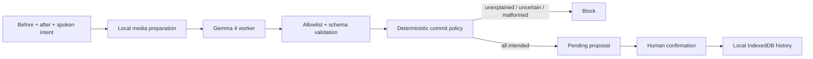

# ScenePatch

**Git for physical creative setups.** ScenePatch compares a before photo, an
after photo, and a short spoken instruction. Gemma 4 proposes a semantic diff;
deterministic TypeScript policy blocks unexplained or uncertain changes and
requires a person to confirm every clean commit.

[Open the public app](https://praharsh-projects.github.io/scenepatch-gemma4/) ·
[Read the architecture](docs/architecture.md) ·
[Inspect the reproducibility notebook](notebooks/scenepatch_gemma4.ipynb) ·
[Review the Kaggle writeup draft](docs/KAGGLE_WRITEUP.md) ·
[Read the security snapshot](docs/SECURITY.md)

ScenePatch is a solo entry for Kaggle's
[Build with Gemma](https://www.kaggle.com/competitions/build-with-gemma-gdgunn/overview)
hackathon. It targets small, controlled art-desk scenes. It is not an inventory,
theft, hazard, compliance, or forensic system.

> **Release status:** the pinned browser q4f16 runtime loaded and emitted native
> calls on the M4 Pro engineering machine, but it proposed a commit for the
> missing-blue-marker fixture. That fails the required semantic gate. The public
> GitHub Pages build is therefore a clearly labeled scripted fixture replay; the
> official-checkpoint Kaggle notebook is the primary executable Gemma path.

## What is implemented

- A polished, anonymous React/TypeScript PWA with setup, capture, semantic-diff,
  and local-history screens. Its Pages release mode labels all fixture outcomes
  as scripted replay rather than model evidence.
- Local multimodal inference with
  [`onnx-community/gemma-4-E2B-it-ONNX`](https://huggingface.co/onnx-community/gemma-4-E2B-it-ONNX),
  `q4f16`, Transformers.js, WebGPU, and a dedicated worker.
- One labeled 1024×512 before/after contact sheet and a 16 kHz mono voice clip
  capped at ten seconds.
- Exactly three Gemma function declarations: `record_change`, `commit_patch`,
  and `block_commit`.
- A strict executor that allowlists tools, validates bounded arguments, rejects
  duplicates, requires one terminal call, retries malformed output once, and
  overrides unsafe commit proposals.
- Human-confirmed IndexedDB history with schema-validated JSON export/import.
  Live audio is never persisted; selected images are retained only when the
  reviewer explicitly opts in.
- Three reproducible canvas fixtures: missing marker, corrected scene, and an
  occluded scene that should fail closed.
- A GitHub Pages static export, generated PWA asset precache, Apache-2.0 license,
  release documentation, and an independent Kaggle GPU notebook.

## Evidence status

Implementation and deterministic tests are complete. Real-model results are not
fabricated: the browser gate failed its core missing-object trial, so no browser
accuracy, dependable-commit, privacy-trace, or offline claim appears in the
competition draft.

| Claim | Current evidence |
|---|---|
| Strict tool policy and fail-closed storage | Automated unit tests |
| Production and GitHub Pages builds | Automated build and rendered-HTML tests |
| Anonymous public app/repository | HTTP 200 and fresh-browser flow verified 31 July 2026 |
| Browser image + voice Gemma mechanism | Loaded, inferred, and parsed on M4 Pro; semantic gate failed |
| Missing-marker block | **Failed:** browser model proposed a clean commit |
| Five clean and five blocked hero trials | Not run after the first required bad-scene failure |
| Inference after disconnecting Wi-Fi | Not tested; no offline claim |
| Offline reload | Not claimed unless the stronger test passes |
| Fixture ownership and publication rights | Human approval required in [`docs/FIXTURE_RIGHTS.md`](docs/FIXTURE_RIGHTS.md) |

The interface reserves approximately 3.65 GB for the selected model cache. The
actual transfer size and first-load duration must be measured against the pinned
release revision rather than copied from this estimate.

## Run locally

Prerequisites: Node.js 22.13 or newer and a current desktop Chrome/Edge build
with WebGPU and `shader-f16` support.

```bash
npm ci
npm run dev
```

Open `http://localhost:3000`. Development mode exposes the experimental browser
runtime for inspection; it is not release-qualified. `npm run build:pages`
intentionally compiles the public scripted-replay mode instead.

Useful release commands:

```bash
npm run typecheck
npm run lint
npm test
npm run build:pages
```

The Pages artifact is emitted to `dist/client`. Its service worker precaches the
replay UI, CSS, manifest, and icons. It deliberately excludes the experimental
Gemma worker and 22 MB ONNX Runtime binary from automatic replay downloads.
Model files are not redistributed by this repository.

## Decision boundary

Gemma emits proposals in its native tool-call format. The application never
evaluates model text as code and never grants the model network, DOM, file,
shell, or IndexedDB authority.



The executor enforces these invariants:

1. one to six unique `record_change` calls;
2. exactly one `commit_patch` or `block_commit` terminal call;
3. no unknown tool, extra argument, invalid classification, or generated code;
4. any `unexplained` or `uncertain` record forces a block;
5. one constrained correction attempt, then fail closed; and
6. only a clean, all-intended proposal can cross the human-confirmation storage
   boundary.

## Privacy and offline wording

The application has no account, application backend, analytics, or telemetry.
Selected media is decoded and processed in the browser. The only expected
first-run network traffic is the public app shell and model/configuration assets
from the model host.

“Local” does not mean “instantly offline.” Do not claim full offline support
until a fresh-profile release test loads the model, closes the tab, disconnects
the network, reopens the public URL, and completes another inference. If only an
already-open tab works after disconnecting, use the narrower statement:
**inference continues offline after loading**.

## Repository map

```text
app/scenepatch-app.tsx       Four-screen product UI and human commit gate
app/workers/gemma.worker.ts  Gemma loading, multimodal processing, generation
app/lib/core/                Tool executor, schemas, hashing, IndexedDB history
app/lib/model/               Worker protocol, compatibility, prompts, parser
app/lib/media.ts             Contact sheet, audio normalization, demo fixtures
docs/                        Architecture, rights gate, storyboard, writeup
notebooks/                   Official-model Kaggle GPU reproduction path
public/                      PWA manifest, service worker, icons, social card
tests/                       Rendered release-shell checks
```

## Primary executable notebook

[`notebooks/scenepatch_gemma4.ipynb`](notebooks/scenepatch_gemma4.ipynb) loads
the official `google/gemma-4-E2B-it` checkpoint, declares the same three tools,
and applies the same fail-closed policy. The browser gate did fail, so this is now
the primary executable Gemma path. It still requires the human-approved fixture,
a Kaggle GPU run, and captured outputs before any result can be claimed. The
public Pages app remains a scripted fixture replay.

## Human-controlled release gates

The entrant must personally approve fixture/media rights, repository visibility,
all measured claims, the final video and writeup, Kaggle rule acceptance and
submission, student-status evidence, payout/KYC, banking, and taxes. Bracketed
`[REQUIRED]` fields in the submission pack are deliberate blockers, not missing
marketing copy.

Copyright 2026 ScenePatch contributors. Code is available under the
[Apache License 2.0](LICENSE). Gemma model weights are separately licensed and
are not included here.
