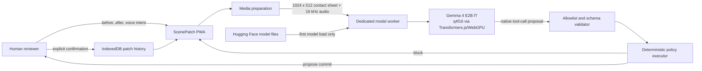

# ScenePatch architecture

> Status: implemented release architecture. Automated checks cover the
> deterministic policy, storage, media contracts, and production/static builds.
> The browser q4f16 mechanism loaded and ran, but failed the missing-marker
> semantic gate on 31 July 2026. GitHub Pages therefore compiles a visibly
> labeled scripted fixture replay; the official-checkpoint notebook is the
> primary executable Gemma path. No browser accuracy or offline claim is made.

## Purpose and boundaries

ScenePatch is semantic change control for small, controlled creative setups. A
user supplies a before photograph, an after photograph, and a short spoken intent.
Gemma 4 E2B compares the scene evidence with that intent and proposes structured
change records. Deterministic application code—not the model—decides whether the
proposal is eligible for human confirmation.

The release is deliberately narrow:

- one before image and one after image;
- one voice clip, normalized to 16 kHz mono and limited to 10 seconds;
- at most six change records;
- creative desk scenes only, not inventory, theft, hazard, medical, forensic, or
  other safety-critical decisions;
- local browser storage only, with no account, application backend, telemetry, or
  paid service.

## System context



No image, audio, prompt, or patch is intentionally sent to an application server.
The browser obtains the public model files directly on first load. Network and
browser developer-tool inspection must confirm this statement before submission.

## Browser data flow

1. **Capability gate.** Check a Chromium browser, WebGPU, `shader-f16`, and a
   storage estimate. Explain unsupported states before inference.
   Request persistent storage where the browser supports it.
2. **Capture.** Decode each user-selected image locally. Strip file metadata by
   drawing pixels into a canvas. Reject empty, unsupported, oversized, or
   excessive-dimension files. Place `BEFORE` and `AFTER` panels side by side in
   one 1024×512 contact sheet. Decode audio locally, downmix to mono, resample to
   16 kHz, and reject audio longer than 10 seconds.
3. **Inference.** Transfer prepared media to a dedicated worker. The worker loads
   `onnx-community/gemma-4-E2B-it-ONNX` at revision
   `9f4bef82ea6e296bc69f8a2f5939f73af81b07a6`, with `dtype: "q4f16"` and
   `device: "webgpu"`. It applies the model's chat template, disables sampling
   and thinking, and limits generation to 128 new tokens.
4. **Validation.** Parse only the three declared tool names. Validate all
   arguments and reject malformed, duplicate, excessive, or ambiguous calls.
5. **Policy.** Require exactly one terminal proposal. Any `unexplained` or
   `uncertain` change overrides a model-proposed commit and blocks it.
6. **Confirmation.** A clean proposal remains pending until a human confirms it.
   Only then may ScenePatch persist the patch and optionally retain source images.
   Audio is discarded after inference by default.

## Gemma interface

The model receives a compact system instruction, the labeled contact sheet, the
normalized voice clip, and exactly these function declarations:

```ts
type Classification = "intended" | "unexplained" | "uncertain";

record_change({
  description: string;
  classification: Classification;
}): void;

commit_patch({ summary: string }): void;
block_commit({ reason: string }): void;
```

The model cannot call JavaScript functions directly. Its generated text is only a
proposal. The executor uses a static map of the three allowed names; it never uses
`eval`, generated code, dynamic imports, shell access, or property lookup on the
global object.

### Validation invariants

- One to six `record_change` calls, with non-empty bounded descriptions.
- No duplicate description after case folding and whitespace normalization.
- Exactly one terminal call: `commit_patch` or `block_commit`.
- No unknown tool, extra argument, or invalid classification.
- A commit plus any `unexplained` or `uncertain` record becomes a deterministic
  block, regardless of the model's terminal call.
- A malformed response receives one constrained repair attempt. A second failure
  becomes a local block with an explicit parse-error reason.

## Local patch record

```ts
interface StoredPatch {
  id: string;
  createdAt: string; // ISO 8601
  schemaVersion: 1;
  confirmedAt: string; // ISO 8601
  modelId: string; // repository@revision
  intentSummary: string;
  thumbnailHashes: {
    before: `sha256:${string}`;
    after: `sha256:${string}`;
  };
  changes: Array<{
    description: string;
    classification: "intended";
  }>;
  decision: "commit_proposed";
  terminalMessage: string;
  inferenceMs: number;
  retainedImages?: { before: Blob; after: Blob };
}
```

The hashes are derived from normalized 256×256 per-scene thumbnails; they are not
proof of identity or provenance. Images default to not retained and are stored
only through an explicit confirmation-screen opt-in. Blocked, empty, or
non-intended drafts are rejected at the storage schema boundary. Deleting the
IndexedDB record also deletes any retained image blobs contained in that record.

## Offline and deployment behavior

GitHub Pages is the primary public host at
[praharsh-projects.github.io/scenepatch-gemma4](https://praharsh-projects.github.io/scenepatch-gemma4/).
The anonymous HTTPS deployment and complete replay flow were verified on 31 July
2026. Its build flag enables scripted replay mode and disables the browser model
action. The experimental local-development path still exposes model loading for
inspection. The Pages service worker precaches its replay UI, CSS, manifest, and
icons while deliberately excluding the experimental model worker and ONNX
Runtime WebAssembly from automatic replay downloads.

Two different claims require different tests:

- **Inference continues offline after loading:** load the app and model, disconnect
  the network, then complete a new inference without reloading the page.
- **Offline after first load:** after the previous step, close the tab, keep the
  network disabled, reopen the public URL, and complete a new inference.

Use only the first statement unless the stronger sequence passes in a fresh
browser profile. Record the browser version, hardware, cache state, and timestamps.

### Browser gate observation — 31 July 2026

- Hardware: MacBook Pro Mac16,8, Apple M4 Pro, 24 GB RAM; Chrome
  150.0.7871.187; WebGPU and `shader-f16` available.
- The pinned eight-file q4f16 cache was verified at 3,381,966,758 bytes; a warm
  WebGPU load reported 5.0 seconds. Browser persistence was not granted.
- The model processed the code-generated desk contact sheet plus a local TTS
  engineering clip and emitted parseable native tool calls.
- On the required bad scene, the blue marker was clearly present in BEFORE and
  absent in AFTER, but the model proposed `commit_patch` with only the intended
  red-marker move. A second disappearance-focused pass also failed to recover
  the omission. This is an unsafe false commit, so the browser release gate is
  failed rather than reported as a success.
- The exact generated TTS clip is approved as controlled competition-fixture
  media. No five-by-five reliability or offline sequence was attempted after the
  core browser bad-scene failure.

### Controlled submission fixture pack — 1 August 2026

Four 640×512 PNG scenes were exported from
`app/lib/media.ts#createSyntheticArtDeskFixture` in one recorded Chrome session:
one common before scene plus bad, corrected, and occluded after scenes. The fixed
intent sentence was synthesized with the open-source CMU Flite 2.3-current
`cmu_us_slt` voice, then normalized to 16-bit PCM, 16 kHz mono (4.755 seconds).
The public `fixtures/generated-v1/manifest.json` freezes every filename, media
property, generator revision, SHA-256 hash, and the approval-record timestamp.

This pack is controlled synthetic mechanism evidence. It does not show model
performance on photographs, natural human speech, or physical scenes. The exact
five media hashes are approved for the release contexts recorded in
`docs/FIXTURE_RIGHTS.md`.

### Competition-linked Kaggle V3 evidence — 2 August 2026

Public [Kaggle V3](https://www.kaggle.com/code/praharshpulla/scenepatch-gemma-4?scriptVersionId=339575640),
Kaggle version ID `202340794` / script version `339575640`, is labeled **COMPLETE
BATCH** and finished in 4m11s in the UI. Its explicit notebook and
[output](https://www.kaggle.com/code/praharshpulla/scenepatch-gemma-4/output?scriptVersionId=339575640)
URLs returned HTTP 200 anonymously. The downloaded executed notebook SHA-256 is
`0c97048417864c5d2c5dfdac835f23f87f6e1ba840b42eccde1a68434bab2a43`.
It has 15 cells: 10 code cells, eight output-bearing code cells, and seven output
files. Model loading took `83.636302238` seconds. Total inference for the bad
case took `15.295668616` seconds over three tool turns and was blocked by
deterministic host policy; the corrected case took `8.560120476` seconds over two
turns and remained pending human confirmation; the occluded case took
`14.269275557` seconds over three turns and was blocked by deterministic host
policy.

The saved-output JSON SHA-256 values are:

- bad: `1b520ccc7914938ec51b3e85972609b0c9f62ca7b29084da625573741e39be28`;
- corrected: `54bc5eef1258d72d4e3eab65c1dd9a2ef9ecaf3c8d892c13357659d1d5a54cd8`;
- occluded: `6093a9456651ea4bd142971163648b6a227f2ee807128af660e6a066e8ee348d`.

Gemma recorded the supplied `red_marker`, `blue_marker`, and `occlusion` labels
as intended and proposed commits. The hash-gated host policy overrode the bad
and occluded proposals because only `red_marker` is approved by the transcript.
This is controlled policy evidence, not independent Gemma classification or
general vision accuracy. The public
[fixture dataset](https://www.kaggle.com/datasets/praharshpulla/scenepatch-controlled-fixture)
contains the exact five approved media files plus their manifest. Its page has a
provenance subtitle and description and reports “Other (specified in
description)” as its license metadata.

The notebook is linked to the Build with Gemma competition, but no entry has
been submitted (`0/5`, “No Submissions”). The bare notebook URL currently
defaults to V1, and V2 (`339574570`) is a source-only quick version; executable
evidence must use the explicit V3 URL.

The approved 1:52 public demonstration is aligned to competition-linked V3
(`339575640`) and its saved timings. Its exact SHA-256 is
`73586989e041648fed9e8ce1966e90940fe64b661e83a0114409ead71a58faf7`.
An anonymous post-deployment download returned HTTP 200, `video/mp4`, the exact
2,740,118-byte length, and that same hash.

## Failure behavior

| Failure | User-visible result | Persisted result |
|---|---|---|
| WebGPU or `shader-f16` unavailable | Compatibility explanation; inference disabled | None |
| Insufficient storage or model download failure | Progress/error state with retry | None |
| Image/audio invalid or over bounds | Specific local validation error | None |
| Worker crash or inference failure | Fail-closed error; replacement worker can be prepared | None |
| Unknown/malformed tool call after one repair | Fail-closed block with parse reason | None |
| Unexplained or uncertain change | Commit action unavailable | None |
| IndexedDB write failure | Commit remains unconfirmed and retryable | None |

## Evidence and release gates

The following fields must be filled from real runs; blank or bracketed fields are
submission blockers:

| Evidence | Required record | Current status |
|---|---|---|
| Public app | Anonymous URL and fresh-browser interaction | **Passed—HTTPS replay deployed and block/correct/confirm/history flow verified** |
| Public repository | Anonymous URL and license check | **Passed—public source and Apache-2.0 license available** |
| Browser model integration | Console/model ID plus captured native tool output | **Mechanism passed; semantic bad-scene gate failed** |
| Initial load | Download bytes and elapsed time | **Exact weight bytes known; first-load elapsed time not captured** |
| Warm load | Cached runtime load on release machine | **5.0 s observation; not a benchmark** |
| Reliability | Five block and five clean trials on the M4 Pro | **Stopped after required bad-scene failure** |
| Offline behavior | Exact test sequence and result | **Not tested; not claimed** |
| Privacy | Network trace showing destinations and payload behavior | **Not yet inspected** |
| Saved Kaggle execution | Version ID plus downloaded output hashes | **Passed—competition-linked V3 (`339575640`) completed full batch and output package verified** |
| Public Kaggle artifacts | Anonymous notebook/output/dataset URL checks | **Passed—explicit V3 notebook and output plus dataset returned HTTP 200** |
| Public demonstration | Exact-hash approval plus anonymous Pages URL | **Passed—HTTP 200, `video/mp4`, length, and SHA-256 verified after deployment** |
| Competition linkage | Linked notebook and submission status | **Linked; no submission made (`0/5`, “No Submissions”)** |
| Fixture rights | Signed approval in `docs/FIXTURE_RIGHTS.md` | **Passed—exact five media hashes approved for repository, Kaggle, and demo video use** |

The [competition deadline](https://www.kaggle.com/competitions/build-with-gemma-gdgunn/rules)
is **3 August 2026 at 23:59 WAT** (22:59 UTC; 4 August at 00:59 CEST). The
internal publication target is **3 August at 18:00 WAT**.
Before submission, the entrant must review the final claims and personally
complete the Kaggle submission.
Student-status verification, payout/KYC, banking, and tax steps also remain human
responsibilities.

## Primary technical references

- [Gemma 4 E2B IT model card](https://huggingface.co/google/gemma-4-E2B-it)
- [Browser ONNX model card](https://huggingface.co/onnx-community/gemma-4-E2B-it-ONNX)
- [Google Gemma 4 function-calling guide](https://ai.google.dev/gemma/docs/capabilities/text/function-calling-gemma4)
- [Transformers.js](https://github.com/huggingface/transformers.js)
